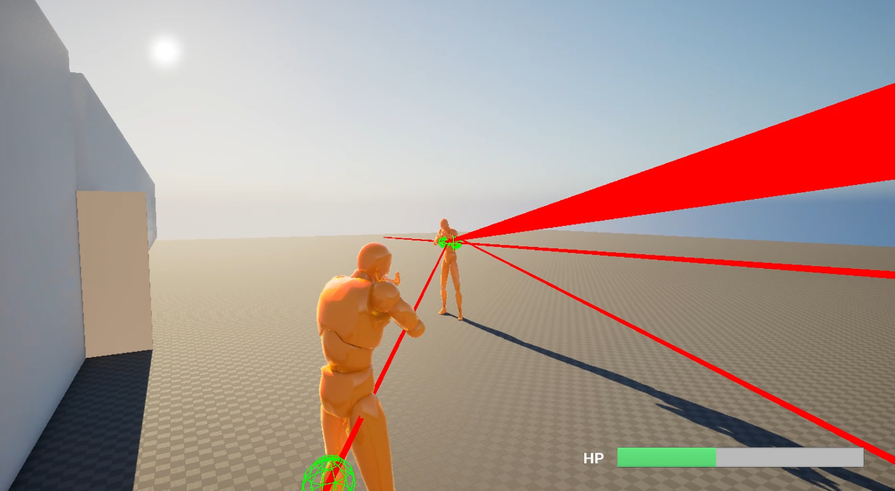

# UE5 C++ Gameplay Demo
## Demo Video

[观看44秒演示视频](https://www.bilibili.com/video/BV1V4346fEw7/)

一个使用 Unreal Engine 5.7 和 C++ 开发的第三人称 Gameplay Demo。

核心玩法逻辑由 C++ 实现，Blueprint 主要用于资源配置、角色外观和 UMG 界面布局。

## Download
[下载Windows Shipping版本](https://pan.baidu.com/s/1dhcOkApwECpsFNfsz6ivVQ?pwd=1234)

## Gameplay Loop

玩家移动与探索
→ 拾取钥匙
→ 开门
→ 遭遇巡逻敌人
→ 敌人感知、追击和攻击
→ 玩家射击并造成伤害
→ 玩家死亡失败，或清空敌人胜利
→ 重新开始关卡

## Features

- Enhanced Input角色移动、视角、跳跃和冲刺
- 基于射线检测的射击与交互
- `IInteractable`交互接口
- 拾取钥匙和开门流程
- AI定点巡逻
- AI Perception视觉感知
- 发现玩家、追击、攻击、攻击冷却
- 丢失玩家后恢复巡逻
- 可复用的`UHealthComponent`
- Damage、生命值、死亡广播
- 玩家和敌人Ragdoll死亡表现
- 玩家血条和准星
- 玩家死亡、重新开始
- 清空敌人、胜利、重新开始
- Windows Development打包验证

## Core Architecture

| 类 | 职责 |
|---|---|
| `AMyCharacter` | 玩家移动、射击、交互和死亡处理 |
| `AMyPlayerController` | Enhanced Input绑定和UI管理 |
| `AEnemyAIController` | 巡逻、感知、追击、攻击与状态切换 |
| `AEnemyCharacter` | 敌人伤害、攻击和死亡表现 |
| `UHealthComponent` | 生命值、伤害处理和死亡广播 |
| `AMyGameModeBase` | 敌人数量统计和胜利条件 |
| `IInteractable` | 可交互对象统一接口 |
| `URestartWidget` | 重新加载当前关卡 |

## Technical Highlights

- 使用Actor Component复用生命系统
- 使用动态多播委托传递血量变化和死亡事件
- 使用Timer控制AI巡逻等待、追击刷新和攻击冷却
- 使用AI Perception处理玩家感知状态
- 使用GameMode管理关卡胜利条件
- 核心Gameplay逻辑使用C++实现

## Controls

| 输入 | 功能 |
|---|---|
| WASD | 移动 |
| 鼠标 | 控制视角 |
| Space | 跳跃 |
| Shift | 冲刺 |
| F | 交互 |
| 鼠标左键 | 射击 |

## Performance

Windows Development打包版本测试：

- CPU：Intel i5-12600KF
- GPU：NVIDIA RTX 2080 Ti
- Frame：约4.71 ms
- Game Thread：约1.44 ms
- Draw Thread：约4.70 ms
- GPU：约4.13 ms
- Draw Calls：约291

测试场景使用约1400×788内部渲染分辨率。该数据仅表示当前Demo场景的性能基线。

## Development Environment

- Unreal Engine 5.7
- C++
- Visual Studio
- Windows

## Status
当前已经完成基础可玩闭环，后续工作主要为作品展示、打包和工程化补充。
